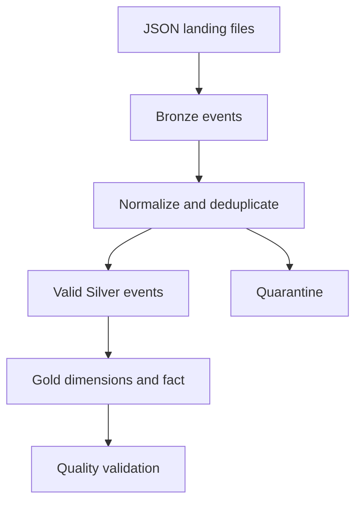

# Airline Booking Lakehouse

A Databricks lakehouse pipeline for synthetic airline booking events, built with Python, PySpark, Delta Lake and Databricks Asset Bundles.

The project demonstrates:

* incremental ingestion with Structured Streaming checkpoints;
* Bronze/Silver/Gold architecture;
* deterministic deduplication and quarantine handling;
* idempotent Delta upserts;
* dimensional modelling;
* executable table-quality checks;
* a four-task Databricks workflow;
* unit tests, linting and wheel builds in GitHub Actions.

All data is synthetic and contains no proprietary airline data or business logic.

## Architecture



The Databricks workflow runs:

```text
ingest_bronze → build_silver → build_gold → validate_gold
```

## Pipeline

### Bronze

Incrementally ingests JSON files from a Unity Catalog volume and adds ingestion metadata. A Structured Streaming checkpoint tracks processed input files.

Target:

```text
workspace.airline_booking_lakehouse.bronze_booking_events
```

### Silver

Normalizes events, deduplicates by `event_id`, applies validation rules and separates valid and invalid records.

Targets:

```text
workspace.airline_booking_lakehouse.silver_booking_events
workspace.airline_booking_lakehouse.silver_booking_events_quarantine
```

### Gold

Selects the latest valid event per `booking_id` and creates:

| Table          | Grain                                           |
| -------------- | ----------------------------------------------- |
| `dim_date`     | One row per departure date                      |
| `dim_flight`   | One row per flight-number and route combination |
| `fact_booking` | One row per current booking state               |

Active and cancelled bookings remain available in the fact table.

See [docs/data_model.md](docs/data_model.md) for the full grain and key definitions.

## Data quality

The final workflow task checks the Gold tables for:

* empty outputs;
* null values in required columns;
* duplicate keys;
* negative measures;
* missing fact-to-dimension foreign keys.

A failed check raises `DataQualityError` and fails the workflow.

Invalid Silver events are written to quarantine rather than silently discarded.

## Idempotency

Reruns are made safe through:

* a Bronze Structured Streaming checkpoint;
* deduplication by `event_id`;
* deterministic event ordering;
* stable date, flight and quarantine keys;
* Delta `MERGE` upserts using table-specific keys.

Running the workflow again without new input preserves the table contents and row counts.

## Example result

A successful end-to-end run produced:

```text
Task ingest_bronze:
Bronze row count: 13

Task build_silver:
Silver row count: 9
Quarantine row count: 3

Task build_gold:
Gold date dimension row count: 5
Gold flight dimension row count: 5
Gold booking fact row count: 5

Task validate_gold:
All Gold table quality checks passed
```

The input reconciles as:

```text
13 Bronze records
= 9 valid Silver events
+ 3 quarantined events
+ 1 removed duplicate
```

## Route-performance analysis

[sql/route_performance.sql](sql/route_performance.sql) joins the fact table with both dimensions and calculates active bookings, passengers, revenue and average booking value by month, route and flight number.

Cancelled bookings are explicitly excluded from this analysis.

## Local development

Requirements:

* Python 3.12;
* Java 17.

Set up the project:

```bash
git clone git@github.com:thomasvanrijsselt/airline-booking-lakehouse.git
cd airline-booking-lakehouse

python3.12 -m venv .venv
source .venv/bin/activate
python -m pip install --editable ".[dev]"
```

Run all local checks:

```bash
python -m pytest
ruff check .
ruff format --check .
python -m build --wheel
```

## Databricks deployment

The workflow expects:

```text
Schema: workspace.airline_booking_lakehouse
Volume: workspace.airline_booking_lakehouse.landing
Input:  /Volumes/workspace/airline_booking_lakehouse/landing/incoming
```

Upload the files from `sample_data/` to the input directory.

Validate, deploy and run the bundle:

```bash
databricks bundle validate -t dev -p airline-booking-free
databricks bundle deploy -t dev -p airline-booking-free
databricks bundle run airline_booking_job -t dev -p airline-booking-free
```

Replace `airline-booking-free` if your Databricks CLI profile has a different name.

## Continuous integration

GitHub Actions runs on pull requests and pushes to `main` and performs:

* Ruff linting;
* formatting validation;
* the complete pytest suite;
* wheel packaging.

Databricks deployment remains a manual authenticated integration step.

## Scope

This is a deliberately compact portfolio project. It uses a small synthetic dataset, fixed development paths and one bundle target.

`dim_flight` represents a flight-number and route combination rather than an individual dated flight occurrence. The example route query assumes the synthetic booking amounts are denominated in EUR.
